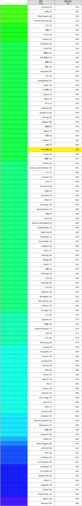
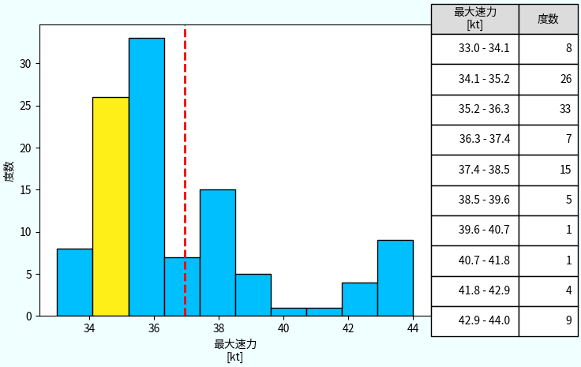

# WowsJsonDataAnalyzer
WowsJsonDataAnalyzer

## Description
WowsJsonDataAnalyzer creates tables and histograms from JSON files that can be obtained with Wargaming API.

## Environment
These programs are tested with
- Ubuntu20.04
- Python 3.8.10

if you haven't installed Matplotlib, you have to install it.
　　　　pip3 install matplotlib

## How to Use
1. modify data/target.json
2. get JSON data from Wargaming API
3. run command below
　　　　python3 python3 get_DD_stats.py

Output files created under ./output
You can get sorted tables and histograms.

## Structure of data/target.json
Write down pair of Tier and Ship Name.
If ShipName is filled, the data of the ship will be highlighted. On the other hand, if ShipName is not filled like `[8, ""]`, no data will be highlighted.

~~~
{
    "target" : [
        [**Tier**, "**ShipName**"],
        [**Tier**, "**ShipName**"],
        [**Tier**, "**ShipName**"]
    ]
}
~~~